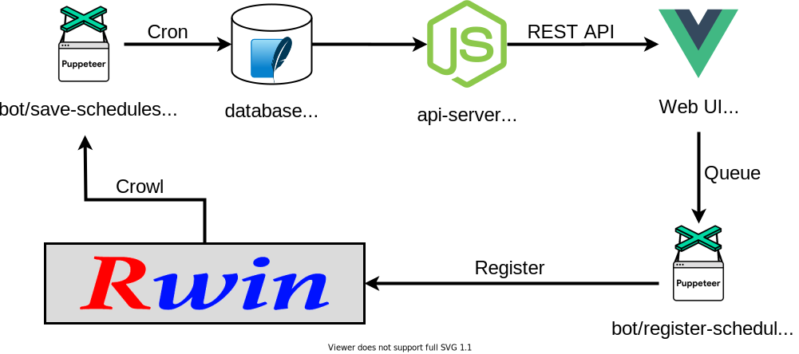

# rwin-bot

Rwin という部屋予約システムのラッパーです。Rwin 自体をできるだけ操作せずにストレスフリーで部屋を予約できるようにするために作りました。

## Architecture

## Components

### bot

Puppeteer を使って Rwin とのインタラクションを自動化します。

#### save-schedules

Rwin に登録されている今日から 1 ヶ月間のスケジュールを定期的にデータベースに保存します。

#### register-schedule

Web UI からリクエストされた新規スケジュールの登録を行います。

### api-server

Express.js を使って、データベースに保存されたデータを REST API として公開します。

### web

Vue.js で作られた Web UI です。スケジュールの閲覧と新規スケジュールの登録ができます。
